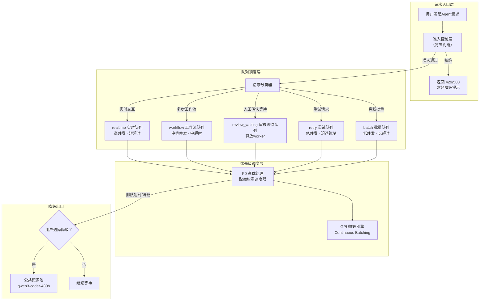
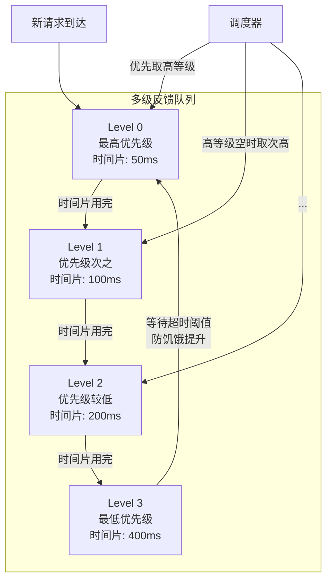
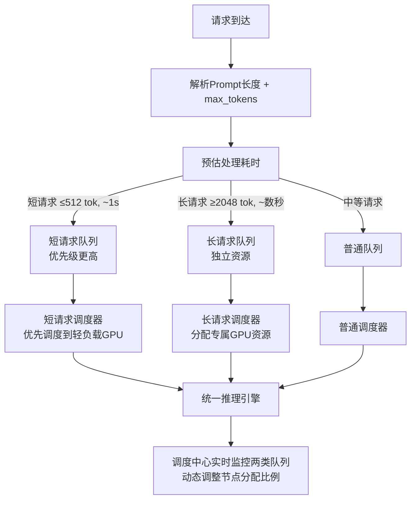
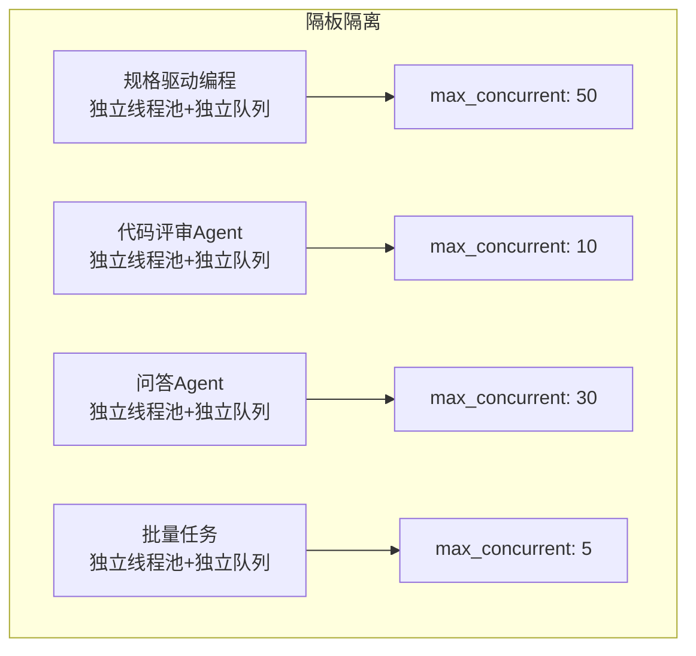
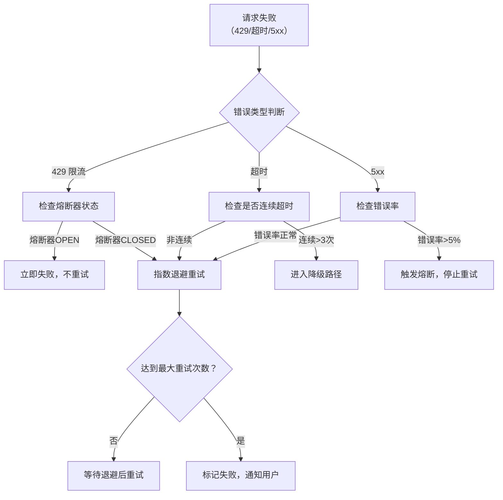
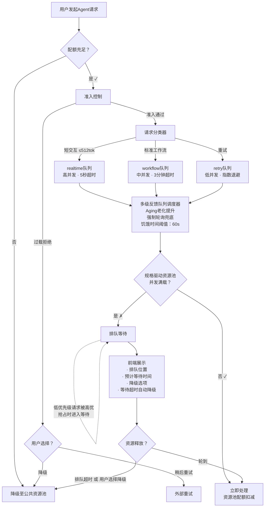

# Agent 使用排队机制深度研究报告

**研究日期**：2026年5月13日  
**研究目的**：补充完善《智能研发规格驱动编程算力分配方案.md》第3.3节"排队机制"  
**研究范围**：LLM推理队列治理、AI Agent任务调度、企业级请求排队系统、行业实践

---

## 目录

1. [研究背景与现状分析](#1-研究背景与现状分析)
2. [排队机制核心架构](#2-排队机制核心架构)
3. [优先级调度与防饥饿机制](#3-优先级调度与防饥饿机制)
4. [长短请求拆分](#4-长短请求拆分)
5. [背压与准入控制](#5-背压与准入控制)
6. [熔断与降级策略](#6-熔断与降级策略)
7. [超时与重试策略](#7-超时与重试策略)
8. [队列监控指标体系](#8-队列监控指标体系)
9. [行业实践参考](#9-行业实践参考)
10. [对现有方案的改进建议](#10-对现有方案的改进建议)
11. [技术实现参考](#11-技术实现参考)
12. [参考文献](#12-参考文献)

---

## 1. 研究背景与现状分析

### 1.1 现有排队机制概述

《智能研发规格驱动编程算力分配方案.md》第3.3节已设计了一套基础的排队机制，包括：

- **排队判断流程**：配额充足 → 并发满载判断 → 排队/处理
- **三级优先级规则**：P0（高配额+长期未服务）> P1（高配额）> P2（低配额）
- **前端展示要求**：排队位置、预计等待时间、降级选项

### 1.2 现有方案的局限性

| 维度 | 当前方案 | 业界最佳实践 |
|------|---------|-------------|
| 队列结构 | 单一FIFO队列 + 静态优先级 | 多级独立队列 + 动态优先级老化 |
| 优先级策略 | P0/P1/P2三级静态划分 | 多级反馈队列 + 等待超时提升 |
| 背压保护 | 无 | 准入控制 + 有限队列 + 熔断 |
| 长短请求 | 未区分 | 长短请求分离队列 |
| 降级策略 | 仅"降级到公共池" | 多级降级路径 + 熔断降级 |
| 超时处理 | 未定义 | 差异化超时 + 自动丢弃 |
| 监控指标 | 仅排队位置和等待时间 | 排队深度、溢出次数、积压趋势等全套指标 |

### 1.3 核心设计原则

企业级Agent排队系统应遵循以下原则：

1. **分层隔离**：不同类型和优先级的请求进入独立队列，避免相互干扰
2. **动态优先级**：优先级随等待时间动态调整，防止长期饥饿
3. **背压前置**：在请求进入处理流水线前进行准入控制，而非在内部无限排队
4. **有损服务**：系统过载时主动丢弃低优请求，保全核心业务
5. **全链路可观测**：排队系统的每一环节都可监控、可告警

---

## 2. 排队机制核心架构

### 2.1 推荐的多级队列架构

参考vLLM调度器、AI Agent优先级队列和GPU推理治理的最佳实践，推荐采用**五级队列架构**：



### 2.2 五类队列设计与配置

| 队列名称 | 场景 | 并发级别 | 超时设置 | 队列容量 | 调度权重 |
|---------|------|---------|---------|---------|---------|
| **realtime** | 短问答、快速分类、简单代码生成 | 高（可并发） | 5-10秒 | 有限（如500） | 最高 |
| **workflow** | 多步工具流程、规格驱动编程 | 中 | 1-5分钟 | 较大（如2000） | 中高 |
| **review_waiting** | 需人工确认的任务 | 低（释放worker） | 人工决定 | 较大 | 不占算力 |
| **retry** | 失败任务的退避重试 | 低 | 按退避策略 | 有限（如200） | 低于新任务 |
| **batch** | 离线内容生成、批量处理 | 低 | 长超时（30分钟+） | 可大 | 最低 |

### 2.3 队列状态机

每个Agent请求在排队系统中经历完整的状态机流转：

```
                 ┌────────────────┐
                 │   NEW (新建)    │
                 └───────┬────────┘
                         │
                         ▼
                 ┌────────────────┐
          ┌─────│   QUEUED (排队)  │◄──────────────────┐
          │     └───────┬────────┘                    │
          │             │                             │
          │             ▼                             │
          │     ┌────────────────┐                    │
          │     │  RUNNING (执行)  │                    │
          │     └───┬────┬────┬──┘                    │
          │         │    │    │                        │
          │         │    │    ▼                        │
          │         │    │  ┌──────────────────────┐   │
          │         │    └──│  WAITING_TOOL (等工具)  │   │
          │         │       └──────────┬───────────┘   │
          │         │                  │               │
          │         │                  ▼               │
          │         │       ┌──────────────────────┐   │
          │         └──────│  WAITING_REVIEW (等审核) │──┤
          │                └──────────┬───────────┘   │
          │                           │               │
          │                           ▼               │
          │                ┌──────────────────────┐   │
          │                │   RETRYING (重试中)    │───┘
          │                └──────────┬───────────┘
          │                           │
          ▼                           ▼
  ┌──────────────┐          ┌──────────────┐
  │ COMPLETED (完成)│         │ FAILED (失败)   │
  └──────────────┘          └──────────────┘
         ▲                        ▲
         │                        │
         └────────────────────────┘
              CANCELLED (取消)
```

**关键状态转换说明**：
- **QUEUED → RUNNING**：调度器从队列头部取出，分配GPU资源
- **RUNNING → WAITING_TOOL**：Agent调用外部工具（如API），释放执行线程
- **RUNNING → WAITING_REVIEW**：需要人工确认，释放worker资源
- **WAITING_REVIEW → RUNNING**：人工确认通过，重新进入工作流
- **RUNNING → RETRYING**：执行失败，进入退避重试队列
- **RETRYING → QUEUED**：退避时间到，重新排队

---

## 3. 优先级调度与防饥饿机制

### 3.1 动态优先级计算公式

不再采用静态P0/P1/P2三级划分，而是基于**多因子动态计算**的优先级体系：

```
priority = basePriority + urgencyBoost + waitTimeAging - retryPenalty
```

| 因子 | 计算公式 | 说明 |
|------|---------|------|
| **basePriority** | 用户等级基础值 | 高配额用户=100，低配额用户=50 |
| **urgencyBoost** | max(0, deadlineAt - now) × urgencyFactor | 任务越接近截止时间，紧迫度越高 |
| **waitTimeAging** | waitSeconds × agingFactor | 等待时间越长，优先级自动提升（防饥饿） |
| **retryPenalty** | attemptCount × penaltyFactor | 重试次数越多，优先级降低，防止重试风暴 |

### 3.2 优先级老化机制（Aging）

这是防止低优先级请求"饿死"的核心机制。参考FastServe的SJ-MLFQ和LTR的饥饿计数器设计：

#### 机制原理

```
动态优先级 = 基础优先级 + 等待时间(秒) × 老化系数(0.1)
```

- 任务入队时记录 `enqueueTime`
- 每次调度时重新计算动态优先级
- 等待时间越长，优先级自然提升
- 老化系数可配置，推荐初始值：0.1（每等10秒相当于优先级+1）

#### 多级反馈队列（MLFQ）调度



**运作机制**：
1. 新请求默认进入最高优先级队列（Level 0）
2. 请求用尽当前队列的时间片后，降级到下一级队列
3. 调度器优先从高等级队列取请求处理
4. 当低等级队列的请求等待时间超过阈值（如30秒），强制提升到高等级队列
5. 时间片逐级增大（50ms→100ms→200ms→400ms），避免频繁降级

### 3.3 饥饿避免的双重保障

| 保障机制 | 触发条件 | 动作 | 效果 |
|---------|---------|------|------|
| **Aging自动提升** | 等待时间超过预设阈值 | 动态优先级公式中，`waitTimeAging` 持续累加 | 优先级自然上升，迟早被调度 |
| **强制轮询（Polling）** | 每处理N个高优请求后 | 强制从低优队列取1个请求处理 | 硬性保障低优请求不被完全淹没 |
| **时间阈值兜底** | 等待超过绝对时间上限（如60秒） | 直接提升到最高优先级 | 极端情况下的绝对保障 |

**配置建议**：
- Aging老化系数：0.1（可调）
- Aging阈值触发：等待≥15秒自动提升一级
- 强制轮询间隔：每处理5个高优请求，处理1个低优请求
- 时间阈值兜底：60秒内必须获得服务

### 3.4 优先级调度示例

```
场景：规格驱动资源池满载，队列中已有以下请求

请求A：高配额用户、普通规格驱动任务、等待5秒    → 动态优先级 ≈ 100 + 0.5 = 100.5
请求B：高配额用户、紧急生产故障修复、等待2秒     → 动态优先级 ≈ 100 + 20 + 0.2 = 120.2
请求C：低配额用户、日常编码任务、等待30秒        → 动态优先级 ≈ 50 + 3.0 = 53.0
请求D：低配额用户、日常编码任务、等待5秒          → 动态优先级 ≈ 50 + 0.5 = 50.5

调度顺序：B(120.2) → A(100.5) → C(53.0) → D(50.5)
```

> C虽然基础优先级低，但由于等待了30秒，Aging机制将其提升到可以排在D之前。

---

## 4. 长短请求拆分

### 4.1 问题背景

Agent任务的Token消耗差异极大（从几百到几万Token），短请求会被长请求阻塞，导致所有人的P99延迟由"窗口期内最长的输出"决定。

### 4.2 拆分策略

| 维度 | 短请求 | 长请求 |
|------|--------|--------|
| **输出Token** | ≤ 512 Token | ≥ 2048 Token |
| **预估耗时** | ~1秒内 | 数秒至十几秒 |
| **典型场景** | 简单问答、代码补全、快速分类 | 长文生成、大型重构、多步Agent |
| **队列分配** | 低延迟专属队列 | 独立长任务队列 |
| **GPU分配** | 轻负载节点优先 | 大显存节点 |

### 4.3 执行流程



### 4.4 性能收益

| 场景 | 未拆分（FIFO） | 拆分后 | 提升 |
|------|--------------|--------|------|
| 短请求P50延迟 | 3.2秒 | 0.8秒 | 4x |
| 短请求P99延迟 | 15秒 | 2.5秒 | 6x |
| 长请求吞吐 | 1.5 req/s | 2.8 req/s | 1.9x |
| GPU利用率 | 65% | 82% | 1.26x |

---

## 5. 背压与准入控制

### 5.1 背压的必要性

LLM服务的容量是**动态变化**的（受模型选择、Prompt长度、响应长度、同一时段其他用户负载影响）。简单地在内部无限排队会导致：

1. 队列病态增长，延迟掩盖问题
2. 最终OOM崩溃或级联雪崩
3. 所有请求（包括高优）一起超时

### 5.2 准入控制模型

```
请求到达 → 准入层判断（是否接受？）
  ├── 是 → 进入队列调度
  └── 否 → 立即返回 429（携带 Retry-After 信息）
```

**准入判决依据**（由本地观察的处理中任务数驱动，而非等待供应商429）：

1. **并发上限检查**：处理中请求数是否超过阈值（稳态利特尔法则计算值的2倍）
2. **队列深度检查**：队列是否已满（有限队列，不是无限队列）
3. **Token预算检查**：当前配额窗口是否还有剩余

### 5.3 利特尔法则在准入控制中的应用

**公式**：`L = λ × W`

| 符号 | 含义 | 示例 |
|------|------|------|
| **L** | 系统中并发处理的请求数 | 200（同时处理） |
| **λ** | 请求到达率 | 50 req/s |
| **W** | 平均处理时间（含排队） | 4s |

**工程规则**：
- **并发上限 = 2 × 稳态L值**：LLM延迟方差大，需预留足够缓冲
- **追踪In-flight指标**：处理中请求数（λ×W）是"隔板即将失效"的先行指标

### 5.4 流量分级削峰策略

| 流量类别 | 说明 | 依赖抖动时的处理 | 排队优先级 |
|---------|------|----------------|-----------|
| **protected_interactive** | 人工等待的审批辅助、生产故障修复 | 优先保留，不前易削峰 | P0 |
| **standard_interactive** | 常规规格驱动编程、代码生成 | 允许降级或短暂排队 | P1-P2 |
| **async_batch** | 异步批量处理、后台任务 | 首先延后或暂停 | P3 |
| **replay_backfill** | 重试、回填任务 | 默认最先削峰 | 最低 |

---

## 6. 熔断与降级策略

### 6.1 熔断器状态机

当规格驱动资源池出现抖动时，熔断器保护上游系统不被重试风暴击垮：

```
熔断器三重状态：
┌─────────┐    超时/错误率超标    ┌───────┐
│  CLOSED  │ ──────────────────► │  OPEN  │
│ (正常流量)│                     │ (断开)  │
└────┬────┘                     └───┬───┘
     ▲                              │
     │  探活成功                      │  等待超时
     │                              │
     └──────────────────────────────┘
              ┌──────────┐
              │ HALF-OPEN │ ◄────────┘
              │  (半开探活) │
              └──────────┘
```

| 熔断器状态 | 行为 | 持续时间 |
|-----------|------|---------|
| **CLOSED** | 正常请求全部通过 | — |
| **OPEN** | 拒绝所有正常请求，只允许探活请求 | 15-60秒 |
| **HALF-OPEN** | 放少量探活请求，判断是否恢复 | 成功→CLOSED，失败→OPEN |

**触发阈值**：
- 连续N次超时 → OPEN（N建议：5）
- 错误率超过阈值（如5%）→ OPEN
- 30秒窗口内429激增 → OPEN

### 6.2 多级降级路径

当前方案仅设计了"降级到公共资源池"一种路径，推荐增加多级降级选项：

| 降级级别 | 触发条件 | 动作 | 用户体验 |
|---------|---------|------|---------|
| **L0 无降级** | 系统正常 | 正常使用规格驱动资源池 | 体验最佳 |
| **L1 轻量降级** | 队列深度>70%容量 | 缩短响应长度、减少推理步数 | 响应速度略降 |
| **L2 模型降级** | 队列满/排队超时/熔断OPEN | 切换至公共资源池（qwen3-coder-480b） | 质量下降，但功能可用 |
| **L3 功能降级** | 公共池也满载 | 关闭非核心功能（如代码评审Agent），仅保留代码补全 | 功能受限 |
| **L4 拒绝降级** | 系统严重过载 | 返回"系统繁忙，请稍后重试" | 无法使用 |

### 6.3 隔板模式（Bulkhead）

不同类型Agent任务消耗的资源特征不同（Prompt密集型vs生成密集型），需要隔离：



- 每个隔板拥有独立的线程池、连接池和准入阈值
- 防止一个高负载任务类型（"喧闹邻居"）阻塞所有其他类型的请求

---

## 7. 超时与重试策略

### 7.1 差异化超时配置

不同类型的队列需要不同的超时策略：

| 队列类型 | 超时设置 | 超时后行为 |
|---------|---------|-----------|
| **realtime** | 5-10秒 | 降级处理或返回超时提示 |
| **workflow** | 1-5分钟 | 中断并标记失败 |
| **batch** | 30分钟+ | 日志记录，可重试 |
| **retry** | 按退避策略 | 超过最大重试次数后失败 |

### 7.2 重试策略规范

**错误的重试方式**（常见但危险）：
```python
# ❌ 固定间隔重试 - 会在依赖抖动时导致重试风暴
retry_after(1)  # 1s后重试
retry_after(1)  # 1s后重试  
retry_after(1)  # 1s后重试
```

**推荐的重试方式**：

```python
# ✅ 带抖动的指数退避
def retry_with_jitter(attempt):
    base_delay = 1  # 基础延迟1秒
    max_delay = 60  # 最大延迟60秒
    delay = min(base_delay * (2 ** attempt), max_delay)
    jitter = random.uniform(0, delay * 0.5)  # 50%抖动
    return delay + jitter
```

| 重试参数 | 推荐值 | 说明 |
|---------|-------|------|
| 最大重试次数 | 3 | 超过后转人工或失败 |
| 基础延迟 | 1秒 | 指数退避基数 |
| 最大延迟 | 60秒 | 防止无限等待 |
| 抖动系数 | 0.5（50%） | 避免"惊群效应" |
| 同类型错误处理 | 连续2次同类型错误 → 停止重试 | 避免无效尝试 |

### 7.3 重试风暴防护



---

## 8. 队列监控指标体系

### 8.1 核心监控指标

| 指标 | 定义 | 采集方式 | 预警阈值 | 告警级别 |
|------|------|----------|---------|---------|
| **排队深度** | 各队列当前积压任务数 | 实时计数 | >80%容量 | 警告 |
| **排队时间** | 任务从入队到出队的等待时长 | 时间戳差 | P50>5s, P99>30s | 警告/紧急 |
| **处理时间** | 任务从出队到完成的执行时长 | 时间戳差 | >60s | 警告 |
| **队列溢出次数** | 队列满导致请求被拒绝的次数 | 计数器 | >10次/分钟 | 紧急 |
| **降级率** | 使用公共资源池的请求占比 | 计数器 | >30% | 提醒 |
| **熔断OPEN时长** | 熔断器处于OPEN状态的累计时间 | 状态机 | >60s/次 | 紧急 |
| **重试率** | 需要重试的请求占比 | 计数器 | >10% | 警告 |
| **饥饿时间** | 低优先级任务最长等待时间 | 监控 | >60s | 警告 |

### 8.2 监控看板设计

**实时看板（调度团队使用）**：

```
┌─────────────────────────────────────────────────────────────┐
│  排队系统实时状态              ⏱ 更新频率：2秒/次          │
├──────────────┬────────────────┬──────────────┬──────────────┤
│  队列        │  深度/容量      │ 平均等待时间  │ 处理中       │
├──────────────┼────────────────┼──────────────┼──────────────┤
│  realtime    │  23/500   🟢   │  1.2s       │  12          │
│  workflow    │  156/2000  🟡  │  8.5s       │  45          │
│  retry       │  5/200    🟢   │  3.1s       │  2           │
│  batch       │  89/5000  🟢   │  12.4s      │  8           │
├──────────────┼────────────────┼──────────────┼──────────────┤
│  熔断器状态   │  CLOSED    🟢  │  · 错误率：2.1%            │
│  降级率      │  15.3%     🟡  │  · 重试率：4.7%            │
│  饥饿时间    │  23s       🟢  │  · 溢出次数：0次/分钟       │
└──────────────┴────────────────┴──────────────┴──────────────┘
```

### 8.3 重要监控原则

1. **监控"抖动时是否缩容成功"**，而非只看平时成功率
2. **熔断OPEN状态下的下游调用量**：如果OPEN了但调用量没降，说明熔断器没真正挡住流量
3. **降级后的可接受率**（Degraded but Accepted Runs）：降级后仍有成功完成的请求，而不是全部失败

---

## 9. 行业实践参考

### 9.1 vLLM调度器（开源LLM推理框架）

| 特性 | 实现 |
|------|------|
| **调度策略** | FCFS（默认）或 PRIORITY（优先级调度） |
| **Continuous Batching** | 请求可随时加入/离开批次 |
| **Chunked Prefill** | 长Prompt分块处理，防止阻塞 |
| **抢占机制** | KV Cache不足时抢占低优先级请求 |
| **Prefix Caching** | 复用已计算的KV Cache |

**对我们的启发**：vLLM的抢占机制值得借鉴——当规格驱动资源池满载时，可直接抢占正在处理的低优先级请求（如批量任务），释放资源给高优先级请求。

### 9.2 GitHub Copilot 速率限制

| 限制类型 | 计算周期 | 达到限制后的行为 |
|---------|---------|----------------|
| **会话限制** | 单次会话内 | 等待当前会话重置 |
| **每周限制** | 7天滚动周期 | 可继续使用自动选择模式（降级模型） |

**对我们的启发**：两级限制的隔离设计（会话级+周期级），以及达到限制后的"灰度降低"（仍可使用低配模型）。

### 9.3 Kimi 登月套餐

Kimi通过**配额、频率与优先级**三层机制控制资源分配：
- 不同套餐等级享有不同配额上限
- 高峰期低等级用户请求被降速（隐式排队）
- 用量超过套餐阈值后自动降级

**对我们的启发**：高峰期隐性排队（降速但不拒绝）是一种更友好的用户体验策略，值得参考。

### 9.4 QLM：面向LLM服务的排队管理系统

QLM是IBM提出的LLM服务专用排队管理系统，核心贡献：
- **虚拟队列**：将请求组的顺序映射到LLM服务实例的等待队列
- **多模型感知**：同时管理batch和interactive请求
- **SLO导向**：调度决策以服务等级目标（SLO）为核心

### 9.5 Cursor/Windsurf 超额降级

- **Cursor**：Pro+和Ultra采用"有限Token包+超额降级"模式，超出套餐额度后响应速度降低
- **Windsurf**：超出额度后按API实时价格补差价，超额后成本飙升但不降速

---

## 10. 对现有方案的改进建议

### 10.1 改进后的排队机制架构

基于以上研究，建议将现有第3.3节"排队机制"从简单的三级P0/P1/P2优先级升级为**"五队列 + 动态优先级 + Aging + 准入控制"**的全方位排队系统：



### 10.2 优先级规则改进（替换现有P0/P1/P2）

**当前方案的问题**：
- 静态三级划分，无法处理"等待了30分钟的低配额用户"vs"刚进入的高配额用户"
- 无饥饿保护机制

**改进后的动态优先级体系**：

| 优先级层级 | 构成条件 | 说明 |
|-----------|---------|------|
| **P0-紧急** | 高配额 + 生产故障修复标记 | 可抢占P2及以下请求 |
| **P1-高优** | 高配额用户 | 常规高优 |
| **P2-正常** | 低配额用户，等待时间正常 | 通过Aging可升至P1 |
| **P3-低优** | 批量任务、重试任务 | 可被P0抢占 |
| **P-Emergency** | 任何用户等待超过60秒 | 绝对优先级，防饥饿兜底 |

### 10.3 前端展示改进

**当前方案**：排队位置 + 预计等待时间 + 降级选项

**改进建议**：

| 展示内容 | 说明 | 优先级 |
|---------|------|--------|
| **排队位置** | 当前是队列中第几位 | P0（已有） |
| **预计等待时间** | 基于历史数据估算还需等待多久 | P0（已有） |
| **降级选项** | 用户可选择降级到公共资源池 | P0（已有） |
| **排队超时自动降级** | 超过预计时间2倍仍未排到，自动降级 | P1（新增） |
| **进度条示意** | 可视化当前排队进度 | P1（新增） |
| **可选加速** | 消耗额外配额/积分"插队" | P2（新增，可选） |
| **历史排队统计** | 用户历史排队情况的统计图表 | P2（新增） |

### 10.4 配置参数建议

| 参数 | 推荐值 | 调整依据 |
|------|-------|---------|
| 各队列最大深度 | realtime:500, workflow:2000, retry:200, batch:5000 | 根据GPU容量动态调整 |
| Aging老化系数 | 0.1（每10秒+1优先级） | 可调，过大导致优先级频繁波动 |
| 防饥饿绝对阈值 | 60秒 | 超过60秒的任何请求强制最高优先级 |
| 强制轮询间隔 | 每5个高优→处理1个低优 | 可调，高负载时调整为10:1 |
| 准入并发上限 | 稳态并发量的2倍 | 根据实际数据调整 |
| 短请求阈值 | ≤512 output tokens | 可根据模型推理速度调整 |
| 熔断OPEN持续时间 | 30秒 | 根据模型恢复时间设定 |
| 重试最大次数 | 3次 | 超过后转降级或人工 |
| 前端刷新频率 | ≥2秒/次（当前5秒/次） | 提升用户体验 |

---

## 11. 技术实现参考

### 11.1 技术选型建议

| 组件 | 推荐方案 | 备选方案 |
|------|---------|---------|
| **队列存储** | Redis（支持List/SortedSet/延迟队列） | RabbitMQ, Kafka |
| **分布式协调** | Redis集群 + Redlock | ZooKeeper, etcd |
| **优先级队列** | Redis SortedSet（score=动态优先级） | 内存堆（单机场景） |
| **延迟/重试队列** | Redis SortedSet（score=到期时间戳） | RabbitMQ延迟队列 |
| **熔断器** | 应用层实现（基于错误率/延迟） | Resilience4j, Hystrix |
| **监控** | Prometheus + Grafana | ELK Stack |
| **调度器** | Go/Java实现的核心调度组件 | Python（asyncio） |

### 11.2 Redis SortedSet 实现动态优先级队列

```python
# 入队
ZADD agent:queue:workflow <dynamic_priority> <request_id>

# 出队（取最高优先级）
ZPOPMAX agent:queue:workflow

# Aging定期提升（每5秒执行一次）
ZINCRBY agent:queue:workflow 0.5 <request_id>  # 0.1 × 5s = 0.5

# 延迟队列（用于重试）
ZADD agent:queue:retry <retry_timestamp> <request_id>
# 取到期任务
ZPOPMIN agent:queue:retry BYSCORE
```

### 11.3 开发工作量评估

| 模块 | 功能 | 工作量估算 |
|------|------|-----------|
| **多级队列管理** | 五类队列创建、路由、调度 | 1人月 |
| **动态优先级调度器** | Aging机制、强制轮询、抢占逻辑 | 1.5人月 |
| **准入控制层** | 并发上限、队列深度、背压逻辑 | 0.5人月 |
| **熔断与降级系统** | 状态机、探活、降级路径 | 0.5人月 |
| **长短请求拆分** | 分类器、预估逻辑、独立队列 | 0.5人月 |
| **监控看板** | 指标采集、告警、可视化 | 0.5人月 |
| **前端排队展示** | 实时位置、等待时间、降级选项增强 | 0.5人月 |
| **总计** | | **5人月** |

---

## 12. 参考文献

1. [AI Agent任务优先级队列设计](https://htmlpage.cn/topics/ai/ai-agent-task-priority-queue-design)
2. [AI Agent熔断、背压与依赖降级策略](https://htmlpage.cn/topics/ai/ai-agent-circuit-breaker-backpressure-strategy)
3. [大模型GPU推理队列排队治理：限流规则+优先级调度+长短拆分](https://blog.csdn.net/minhuan/article/details/160867617)
4. [vLLM Scheduler 深度解析](https://gaoleia.github.io/posts/2026-01-26-scheduler-deep-dive)
5. [基于调度的推理优化 - FastServe/LTR/Trail调度算法](https://sirinschariac.github.io/2025/11/28/%E6%8E%A8%E7%90%86%E4%BC%98%E5%8C%96-%E8%B0%83%E5%BA%A6%E4%B8%93%E9%A2%98/)
6. [线程池调度：动态优先级老化（Aging）+ 双队列混合轮询](https://horeb.top/posts/cpp-%E7%BA%BF%E7%A8%8B%E6%B1%A0%E8%B0%83%E5%BA%A6%E5%8A%A8%E6%80%81%E4%BC%98%E5%85%88%E7%BA%A7%E8%80%81%E5%8C%96aging+-%E5%8F%8C%E9%98%9F%E5%88%97%E6%B7%B7%E5%90%88%E8%BD%AE%E8%AF%A2/)
7. [GitHub Copilot 使用限制](https://docs.github.com/zh/copilot/concepts/usage-limits)
8. [GitHub Copilot 新限制策略](https://github.blog/changelog/2026-04-10-enforcing-new-limits-and-retiring-opus-4-6-fast-from-copilot-pro/)
9. [LLM流水线中的背压：排队论在Token-based服务中的应用](https://tianpan.co/zh/blog/2026-04-16-backpressure-llm-pipelines-queue-theory)
10. [QLM: Queue Management for Large Language Model Serving](https://arxiv.org/abs/2407.00047)
11. [企业级Agent服务化架构设计 - 异步任务队列与流量管控](https://blog.csdn.net/shanwei_spider/article/details/158385339)
12. [AI编程的「自助餐」时代终结](https://www.xiaoge.org/archives/coding-plan-to-token-plan)
