# 智能研发规格驱动编程算力分配方案

---

## 目录

1. [方案背景与核心矛盾](#1-方案背景与核心矛盾)
2. [分配原则与总体架构](#2-分配原则与总体架构)
3. [算力分层模型](#3-算力分层模型)
4. [配额分配方案](#4-配额分配方案)
5. [人员分级与管理制度](#5-人员分级与管理制度)
6. [配额重置周期方案](#6-配额重置周期方案)
7. [动态调整与置换机制](#7-动态调整与置换机制)
8. [效果评估体系](#8-效果评估体系)
9. [实施方案与落地计划](#9-实施方案与落地计划)
10. [附录：关键参数说明](#10-附录关键参数说明)

---

## 1. 方案背景与核心矛盾

### 1.1 背景

公司拥有约 **10,000 名研发人员**，分布在 **7 个研发部**（研发部 → 部门 → 团队 → 个人四级架构）。当前已部署智能研发工具，用于支持**规格驱动编程**工作模式。

### 1.2 当前资源现状

当前共有**三个资源池**服务于规格驱动编程：

| 资源池                   | 硬件配置                            | 用途                     | 管控方式                                |
| ------------------------ | ----------------------------------- | ------------------------ | --------------------------------------- |
| **测试验证资源池** | 单独一台设备（独立PPU）             | 用于模型测评、验证、测试 | 专用设备                                |
| **规格驱动资源池** | 13 台 PPU，19 个实例                | 支撑规格驱动编程核心场景 | **白名单准入**，可支撑约 1,800 人 |
| **公共资源池**     | 2 个华为大 EP qwen3-coder-480b 实例 | 白名单以外的所有人共用   | 开放使用，不受配额管控                  |

### 1.3 核心矛盾

| 资源                     | 供给                | 需求              | 缺口                     |
| ------------------------ | ------------------- | ----------------- | ------------------------ |
| 规格驱动资源池（强模型） | 支撑约 1,800 人规模 | 10,000 人全部需要 | **82% 的覆盖缺口** |

### 1.4 关键定义

| 术语                     | 说明                                                                                             |
| ------------------------ | ------------------------------------------------------------------------------------------------ |
| **规格驱动编程**   | 以业务规格/需求文档为输入，由AI智能体辅助完成代码生成、重构、验证的工作模式                      |
| **规格驱动资源池** | 核心资源池（13台PPU/19个实例），运行强模型，支撑规格驱动编程，白名单准入                         |
| **公共资源池**     | 2个华为大EP qwen3-coder-480b实例，开放使用，作为降级后的备选资源                                 |
| **配额**           | 每人在指定周期内可使用规格驱动资源池的**Token 额度**，由系统实时扣减                       |
| **降级**           | 配额用完后自动从规格驱动资源池切换至**公共资源池**（qwen3-coder-480b），体验下降但功能可用 |

---

## 2. 分配原则与总体架构

### 2.1 四大分配原则

| 原则                              | 说明                                                     |
| --------------------------------- | -------------------------------------------------------- |
| **① 同一资源池，差异配额** | 所有人使用同一规格驱动资源池，体验一致；配额区分使用深度 |
| **② 团队先行，骨干兼顾**   | 优先保障试点团队的规格驱动编程需求，同时覆盖个人骨干     |
| **③ 用完降级，体验牵引**   | 配额用完自动切换至公共资源池，用"体验落差"引导理性使用   |
| **④ 能上能下，动态置换**   | 月度评估效果，低效者让渡配额，高效者获得更多资源         |

### 2.2 总体架构

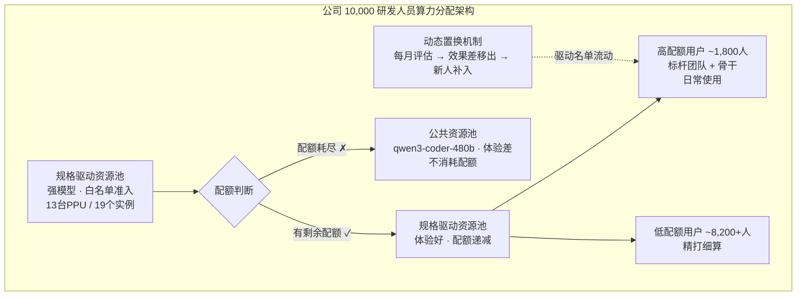

---

## 3. 算力分层模型

### 3.1 两层资源池模型

| 层级                | 资源池         | 模型                      | 容量         | 配额管控    | 覆盖               |
| ------------------- | -------------- | ------------------------- | ------------ | ----------- | ------------------ |
| **L1 正常态** | 规格驱动资源池 | 强模型（13PPU/19实例）    | ~1,800人并发 | ✅ 配额制   | 全员可用，配额不同 |
| **L2 降级态** | 公共资源池     | qwen3-coder-480b（2实例） | 全员共享     | ❌ 开放使用 | 配额用完自动触发   |

### 3.2 配额机制核心逻辑

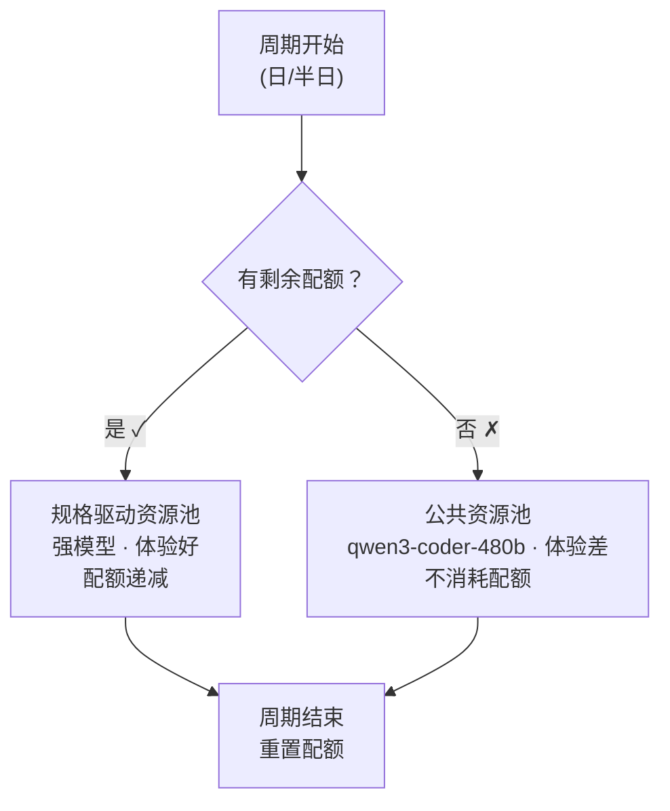

### 3.3 排队机制

当规格驱动资源池并发满载时，未获得资源的请求进入排队队列。

**排队逻辑**：

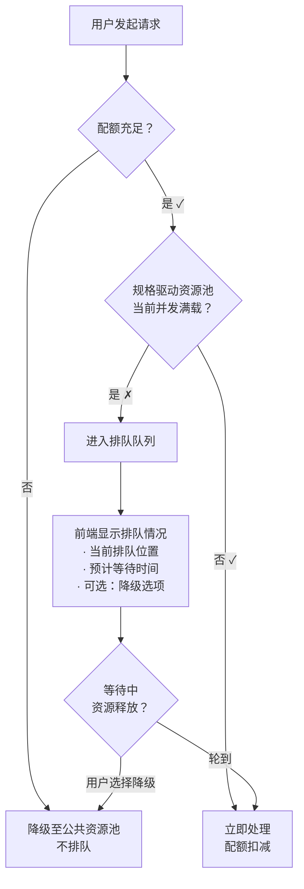

**前端展示要求**：

- 排队中实时显示：**当前排队位置**、**预计等待时间**
- 提供**降级选项**：用户可选择不等队，直接切换至公共资源池
- 排队进度更新频率：≥ 5秒/次

---

## 4. 配额分配方案

### 4.1 分配方式

采用 **全个人配额制（方案2）**：

- 每个研发人员独立拥有个人配额
- 按个人维度分配、消耗、统计
- 评估成效时按**团队聚合**（团队维度考核，个人维度执行）

**选择理由**：

| 维度     | 团队池方案              | 个人配额方案（✅ 选定）    |
| -------- | ----------------------- | -------------------------- |
| 开发量   | 中（需池管理+调配逻辑） | **低**（单人表即可） |
| 实现周期 | 较长                    | **短**（快速上线）   |
| 团队报告 | GROUP BY即可            | **同样支持**         |
| 人员调动 | 额度需迁移              | **修改个人配置即可** |
| 用户感知 | "我的额度是多少？"      | **清晰明了**         |

### 4.2 两档配额体系

| 档位             | 适用人群                |        Token 配额/天        |       覆盖目标       | 按半日重置方案 |
| ---------------- | ----------------------- | :-------------------------: | :-------------------: | :------------: |
| **高配额** | 标杆团队成员 + 个人骨干 | **1,600 万 Token/天** | **≤ 1,800 人** |  800 万/半日  |
| **低配额** | 其他研发人员            |  **200 万 Token/天**  |      ~8,200+ 人      |  100 万/半日  |

> **配额计算依据**：
>
> - 1 次完整 Agent 任务 = 10 轮交互 × 4 万 Token/轮 = **40 万 Token**
> - 低配额足以完成 **5 次任务/天**（200 万 ÷ 40 万）
> - 高配额基于统计数据的四分之三分位：去除日均 20 次对话以下的用户后，75% 分位值为 38 次/天，取整至 **40 次/天** → 1,600 万 Token
> - 高/低配额比值约为 **8 倍**

### 4.3 高配额名额分配机制

#### 首批分配：申报审批制

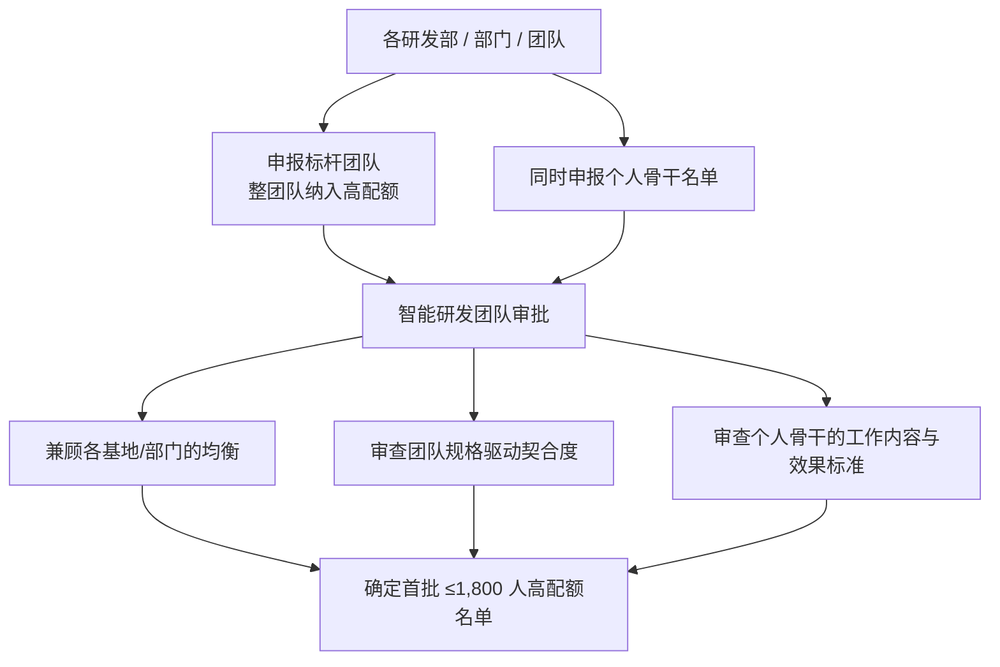

**审批兼顾原则**：

- 避免某个部门申报过多，挤压其他部门空间
- 确保各基地都有代表性团队参与试点
- 优先支持已形成规格驱动编程工作模式的团队

#### 高配额人员构成

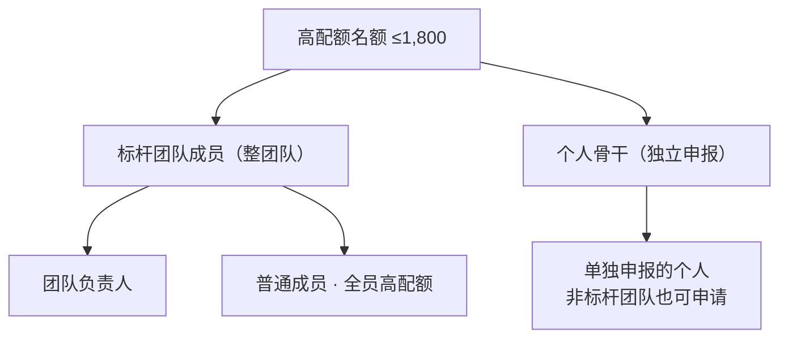

> 最终高配额 = 标杆团队成员 + 个人骨干，总数不超过 1,800

### 4.4 低配额说明

- 所有未进入1,800名单的研发人员默认获得低配额
- 在配额范围内，**与高配额用户使用同一规格驱动资源池**，体验无差别
- 配额用完后自动降级至**公共资源池**（qwen3-coder-480b）
- 低配额用户可通过效果表现，在月度置换中进入高配额名单

---

## 5. 人员分级与管理制度

### 5.1 骨干界定标准

个人骨干的认定需同时满足以下条件：

| 维度                  | 标准要求                     | 说明                                 |
| --------------------- | ---------------------------- | ------------------------------------ |
| **工作方式**    | 以规格驱动编程为主要工作方式 | 日常开发以"理解规格→代码生成"为主线 |
| **代码量**      | 月度AI辅助生成代码量达标     | 具体值待定，基于统计数据设定         |
| **Token使用量** | 月度智能体Token消耗量达标    | 反映实际使用深度                     |
| **入库率**      | AI生成代码的采纳/入库率达标  | 反映生成质量，避免"生成多但弃用多"   |

### 5.2 人员分类全景

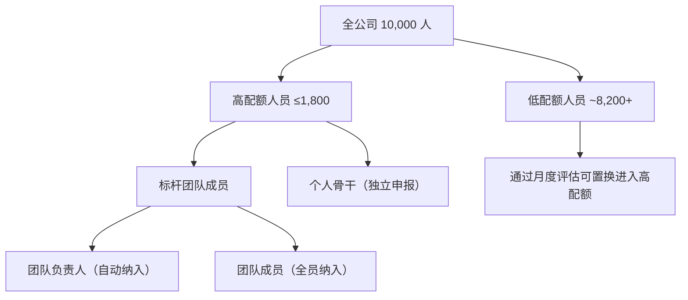

### 5.3 角色与责任

| 角色                        | 责任                                   |
| --------------------------- | -------------------------------------- |
| **智能研发团队**      | 配额审批、月度评估、动态调整、效果监控 |
| **研发部/部门负责人** | 组织申报、推动团队使用、监督效果       |
| **团队负责人**        | 团队内使用指导、效果跟踪、问题反馈     |
| **个人用户**          | 在配额内高效使用、关注使用效果         |

---

## 6. 配额重置周期方案

### 6.1 方案概览

| 方案                        | 重置周期   | 说明                | 参考案例     |
| --------------------------- | ---------- | ------------------- | ------------ |
| **方案A（默认推荐）** | 按日重置   | 每天 00:00 刷新配额 | 行业通用做法 |
| **方案B（备选）**     | 按半日重置 | 每 12 小时刷新一次  | 招商银行实践 |

### 6.2 方案A：按日重置

**机制**：

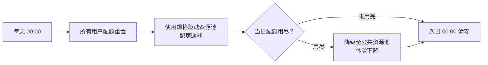

**优点**：

- 理解成本最低："每天X次/每天Y Token"
- 匹配自然工作节奏（上午规划→下午编码）
- 开发实现简单，时间戳+配额计数器即可

**缺点**：

- 早高峰瞬时压力集中（全员满配额并发）
- 上午用完下午无法使用强模型

### 6.3 方案B：按半日重置（推荐备选）

**机制**：

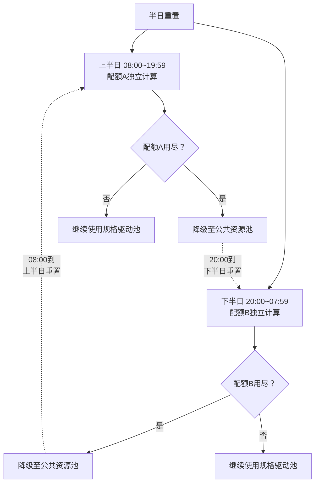

**优点**：

- ✅ **天然错峰**：不同时区的基地、不同作息习惯的人自动分散使用
- ✅ **全天续航**：上半日用完了，下午还有新配额，持续工作不中断
- ✅ **午间空档**：午休时释放的算力可以为下午积蓄
- ✅ **已被验证**：招商银行采用此模式，实践效果良好

**缺点**：

- 开发量略高于按日重置（需维护两个时间段计数器）
- 用户教育成本略高（需说明"为什么分两段"）

### 6.4 建议实施路径

**阶段一（快速上线）**：先按日重置上线，最快验证配额机制
**阶段二（优化迭代）**：上线后观察并发分布，如早高峰压力过大则切换为半日重置
**阶段三（参数调优）**：基于实际使用数据，微调每个周期的配额量

> 建议后台预留**重置周期配置项**，支持随时切换，无需重新开发。

### 6.5 配额量设计参考

基于"基础配额至少完成几轮完整的智能体对话"的要求，配额量设计如下：

| 档位             |               按日重置方案               |         按半日重置方案         | 说明                                 |
| ---------------- | :--------------------------------------: | :-----------------------------: | ------------------------------------ |
| **高配额** | **1,600 万 Token/天**（~40次任务） | 800 万 Token/半日（~20次任务） | 满足高频规格驱动编程（四分之三分位） |
| **低配额** |  **200 万 Token/天**（~5次任务）  | 100 万 Token/半日（~2-3次任务） | 保证基础规格对话能力                 |

> **计算依据**：单次 Agent 任务约 10 轮交互，平均每轮 4 万 Token，合计 40 万 Token/任务。

---

## 7. 动态调整与置换机制

### 7.1 月度评估流程

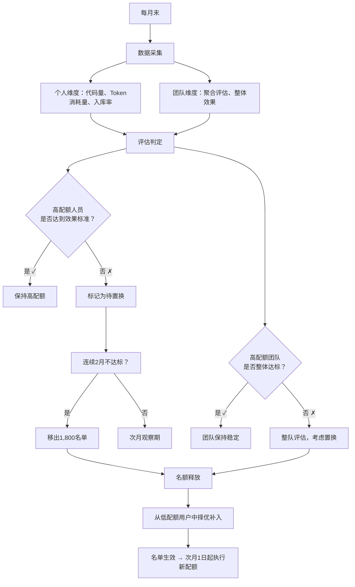

### 7.2 置换规则

| 场景                          | 操作                            | 频率 |
| ----------------------------- | ------------------------------- | ---- |
| 高配额个人效果不达标（1个月） | ⚠️ 警告通知，次月观察期       | 月度 |
| 高配额个人连续2月不达标       | 🔄 移出高配额，置换新人补入     | 月度 |
| 高配额团队整体不达标（1个月） | ⚠️ 警告团队负责人，限期改进   | 月度 |
| 高配额团队连续2月整体不达标   | 🔄 整队移出，由申报的新团队补入 | 月度 |
| 低配额用户效果突出            | ⭐ 优先纳入置换候选池           | 月度 |
| 高配额个人存在额度严重浪费    | 🔄 即时移出（可提前）           | 按需 |

### 7.3 团队稳定性保障

- **团队尽量保持稳定**：除非整队效果都不达标，否则不移除整队
- **个人置换先行**：优先调整团队内不达标的个人，保持团队骨架
- **整队评估标准**：团队平均效果低于低配额用户平均水平的，才考虑整队置换

### 7.4 流动性控制

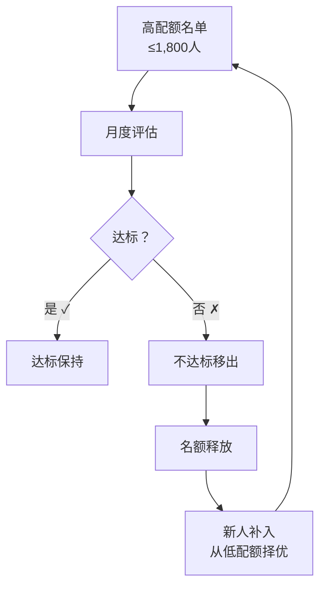

---

## 8. 效果评估体系

### 8.1 核心评估指标

| 指标                  | 定义                              | 采集方式     | 评估对象 |
| --------------------- | --------------------------------- | ------------ | -------- |
| **Token消耗量** | 月度规格驱动资源池消耗的Token总量 | 系统统计     | 个人     |
| **入库率**      | 生成代码被采纳并入库的比例        | 版本控制集成 | 个人     |
| **使用连续性**  | 月度内活跃天数                    | 工具日志     | 个人     |
| **配额利用率**  | 实际消耗 / 配额总量               | 系统统计     | 个人     |

### 8.2 团队评估方式

采用 **"分配按个人，考核按团队"** 的方式：

**团队成效核心关注维度**：

- **研发周期**：团队需求从开发到交付的周期变化
- **缺陷密度**：单位代码量的缺陷率变化

> 详细指标体系参见《智能研发运营指标体系》，此处不再展开。

### 8.3 评估数据看板（建议）

| 视图               | 查看角色     | 展示内容                                     |
| ------------------ | ------------ | -------------------------------------------- |
| **个人看板** | 个人用户     | 我的配额、已用/剩余、消耗趋势、入库率        |
| **团队看板** | 团队负责人   | 团队成员配额使用、研发周期趋势、缺陷密度变化 |
| **部门看板** | 部门负责人   | 各团队研发周期对比、缺陷密度分布             |
| **全局看板** | 智能研发团队 | 1,800人名单状态、置换候选池、系统负载        |

---

## 9. 实施方案与落地计划

### 9.1 实施路线图

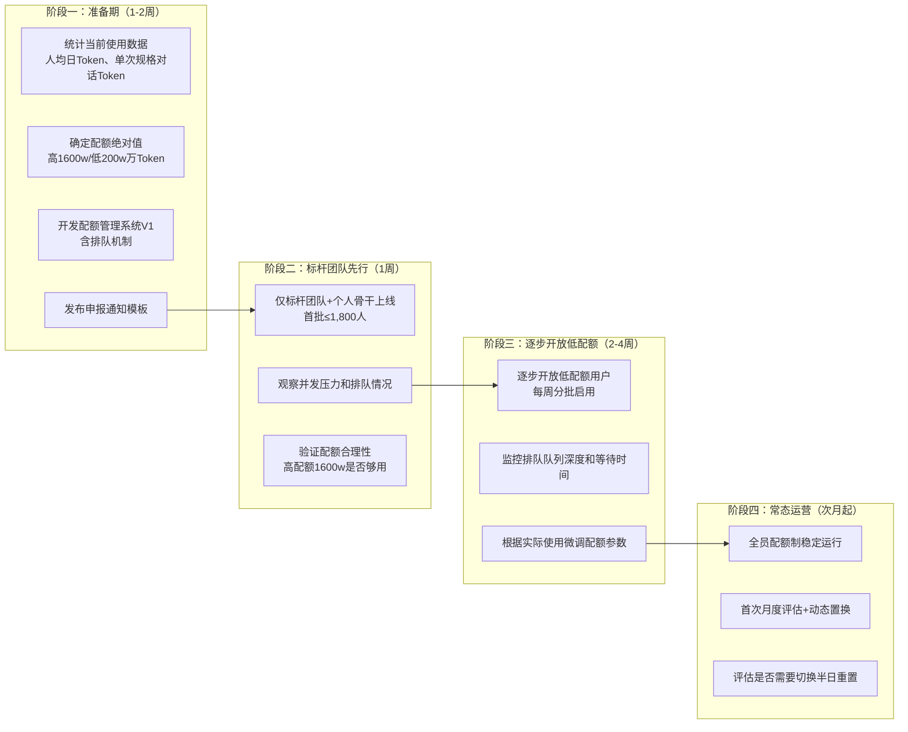

### 9.2 需开发的配额管理系统功能

| 模块                   | 功能                                     | 优先级 | 工作量估算 |
| ---------------------- | ---------------------------------------- | ------ | ---------- |
| **配额分配**     | 人员名单导入、高/低配额标记、批量修改    | P0     | 小         |
| **配额扣减**     | 每轮智能体对话消耗Token实时扣减          | P0     | 中         |
| **排队调度**     | 请求队列管理（P0/P1/P2优先级队列）       | P0     | 中         |
| **排队前端展示** | 实时显示排队位置、预计等待时间、降级选项 | P0     | 中         |
| **降级触发**     | 配额耗尽自动降级小模型                   | P0     | 中         |
| **重置调度**     | 按日/半日自动重置配额计数器              | P0     | 小         |
| **个人看板**     | 用户端查看剩余配额、消耗趋势             | P1     | 中         |
| **月度评估**     | 效果数据聚合、达标判定、置换建议         | P1     | 中         |
| **管理后台**     | 名单管理、置换操作、数据总览             | P1     | 中         |
| **团队报表**     | 按团队聚合效果数据                       | P2     | 小         |

### 9.3 关键风险与应对

| 风险                       | 影响           | 应对                                                                         |
| -------------------------- | -------------- | ---------------------------------------------------------------------------- |
| 申报团队过多，远超1,800    | 审批压力大     | 明确优先标准，分批纳入                                                       |
| 低配额用户"不够用"反馈集中 | 用户满意度下降 | 宣导降级至公共资源池仍可继续使用，展示置换通道                               |
| 排队等待时间过长影响效率   | 开发效率下降   | 三步走：①前端透明展示排队状态 ②排队超时提供降级选项 ③观察后调整配额或扩容 |
| 首次开放并发冲击           | 系统压力       | **标杆团队先行 → 逐步开放普通用户**，分阶段控制并发                   |
| 高配额人员浪费配额不干活   | 资源浪费       | 月度评估+即时警告机制                                                        |
| 半日重置并发压力测试不通过 | 系统性能       | 先按日上线，平稳后切换                                                       |
| 入库率统计口径争议         | 评估公正性质疑 | 提前明确入库率定义和采集方式                                                 |

---

## 10. 附录：关键参数说明

### 10.1 需后续确定的关键参数

| 参数                             |            数值            | 说明                          |
| -------------------------------- | :-------------------------: | ----------------------------- |
| **单次Agent任务Token消耗** |         40 万 Token         | 10轮 × 4万/轮，已确认        |
| **高配额绝对值**           | **1,600 万 Token/天** | 四分之三分位取整至40次对话/天 |
| **低配额绝对值**           |  **200 万 Token/天**  | 约5次任务/天                  |
| 低配额相对倍数                   |         1/8 高配额         | 200万 ÷ 1,600万              |
| 入库率达标线                     |            待定            | 首批数据跑完后设定基准线      |
| 代码量达标线                     |            待定            | 首批数据跑完后设定基准线      |
| 半日切换阈值                     |            待定            | 观察早高峰并发压力后决定      |

### 10.2 参考行业实践

| 实践                                | 来源       | 可借鉴点                                                    |
| ----------------------------------- | ---------- | ----------------------------------------------------------- |
| **招商银行半日重置**          | 银行同业   | 按半日重置配额，错峰使用，已被验证有效                      |
| **QClaw 每日积分制**          | 类龙虾工具 | 每人每天 800 积分，按日重置的透明配额机制                   |
| **WorkBuddy 签到积分**        | 类龙虾工具 | 注册送 3000 + 每月 500 + 每日签到 100，通过行为激励补充配额 |
| **GitHub Copilot Token 计费** | 国际厂商   | 2026年6月起全面转向 Token 计费，不同模型差异化消耗          |
